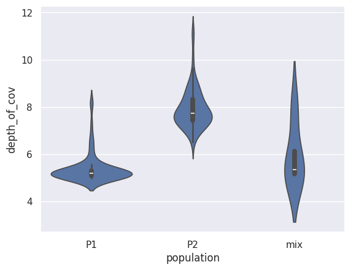

# Distribution_per_group

## Description

This challenge consist of using the data in "data_test.tsv" to answer the following question ¿Which population has the highest coverage per sample?. To answer the question make code to create the following plot:

In this plot the coverage of an assembly of RAD-loci per samples is shown. The samples are grouped per population. 

## Recomendations

You can complete this challenge with a jupyter notebook in gooogle collab (Drive). Or a script in python/R.